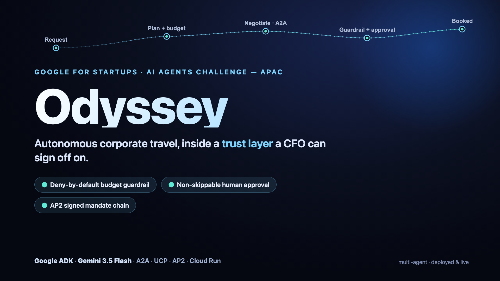
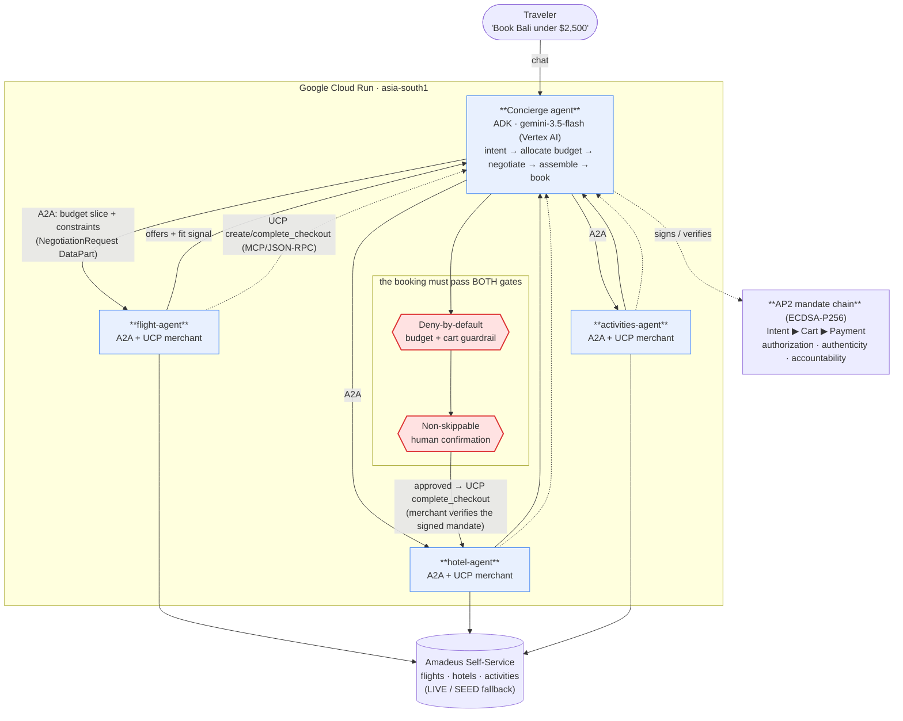

# Odyssey



**Odyssey is the trust-and-control layer for autonomous business travel — a multi-agent
concierge that negotiates and books budget-respecting, multi-vendor trips across flights,
hotels and activities, but spends nothing without a human-confirmed, ECDSA-P256-signed
mandate that gives finance a non-repudiable audit trail and a budget it cannot exceed.**

Built for the **Google for Startups AI Agents Challenge · Track 2: Optimize (Existing Agents) · Region: APAC**.

**Live demo (public):** https://odyssey-concierge-4ha6ffo6hq-el.a.run.app — pick `concierge`, ask
for a trip. (Cloud Run scale-to-zero — first request may cold-start a few seconds.)

> ⚠️ **Demo / hackathon project.** AP2 mandates are signed with **real ECDSA P-256** (a single
> deterministic demo keypair; production uses per-party keys / a PKI). **No real money moves and no live payment rail is called.**

---

## What It Does

- **Conversational multi-vendor booking.** One prompt ("Plan a 5-day Bali trip from JFK, 2 people,
  Sep 1–6 2026, total budget $2,500, beachy and foodie") books flights + hotel + activities
  end-to-end without leaving the chat. The concierge splits the budget across vendors and
  negotiates each slice independently.

- **Deny-by-default budget guardrail.** A `before_tool_callback` intercepts every checkout tool
  call. Checkout is hard-blocked unless a non-empty cart exists and the cart total is ≤ the
  authorised budget. If budget is missing, the gate fails closed — the booking is denied rather
  than allowed through.

- **Non-skippable human confirmation.** The final `complete_trip` tool is registered with ADK
  `require_confirmation=True`. The LLM cannot invoke it without pausing for explicit user
  approval — two independent gates, both must pass.

---

## Live Demo / Testing Access

**Public live demo:** https://odyssey-concierge-4ha6ffo6hq-el.a.run.app
4 services on Google Cloud Run (asia-south1). Gemini 3.5 Flash via Vertex AI
(runtime service account — no API key needed on the server side).
See [`docs/DEPLOYMENT.md`](docs/DEPLOYMENT.md) for service URLs.

### Judge flow — zero-cost, no API keys required

```bash
# 1. Install (Python 3.12 recommended)
uv venv --python 3.12 && uv pip install -e ".[dev]"

# 2. Copy env template — ODYSSEY_DATA_MODE=SEED is the default (no keys needed)
cp .env.example .env

# 3. Terminal 1: start the three merchant agents
./scripts/run_merchants.sh

# 4. Run the full offline test suite (59 tests, 0 API keys needed)
uv run pytest -q

# 5. (Optional) Live concierge UI — requires a free Google AI Studio key in .env
./scripts/run_web.sh
# Open http://localhost:8000 → select odyssey_concierge → try:
# "Plan a 5-day Bali trip from JFK for 2, Sep 1–6 2026, budget $2500, beachy and foodie."
```

| What | Command | Keys needed? |
|------|---------|:---:|
| Merchant servers (A2A + UCP endpoints, SEED inventory) | `./scripts/run_merchants.sh` | None |
| Full offline test suite | `uv run pytest -q` | None |
| Safety eval with metrics table | `uv run pytest tests/test_safety_eval.py -v -s` | None |
| Live concierge chat UI | `./scripts/run_web.sh` | Free [Google AI Studio key](https://aistudio.google.com/) |
| Public cloud demo | https://odyssey-concierge-4ha6ffo6hq-el.a.run.app | None |

> `ODYSSEY_DATA_MODE=SEED` activates in-process stub inventory (fixed prices: flight $812,
> hotel $640, activity $55). No Amadeus key, no cloud credentials — judges can run the
> full suite and both trust gates instantly.

---

## Technical Implementation

**Stack:** Google ADK · Gemini 3.5 Flash on Vertex AI · Agent2Agent (A2A) ·
Universal Commerce Protocol (UCP) · Agent Payments Protocol (AP2) ·
MCP (JSON-RPC 2.0) · FastAPI · Google Cloud Run × 4 (asia-south1)

**Real cross-process A2A negotiation (verified live, 2026-06-02):** the concierge splits
the budget (45 / 40 / 15) and sends a `NegotiationRequest` DataPart to each merchant over
A2A — a separate Cloud Run service, not in-process. Concierge logs confirm
`negotiate[hotel] via A2A slice=1000 fits=True`; merchant logs confirm `POST / 200` +
`convert_event_to_a2a_message`. Each merchant runs its own Gemini call, returns
`find_offers` results as an A2A DataPart, and the concierge assembles + books over UCP
(`POST /mcp`). See [`docs/DEPLOYMENT.md`](docs/DEPLOYMENT.md).

**Protocol roles:**

| Protocol | Role in Odyssey |
|----------|-----------------|
| **A2A** | Concierge → merchant `NegotiationRequest` (budget slice + constraints); cross-process between Cloud Run services |
| **UCP** | Each merchant exposes `/.well-known/ucp` + MCP endpoint (`search_catalog`, `create_checkout`, `complete_checkout`) |
| **AP2** | Signed Intent → Cart → Payment mandate chain; merchant verifies the user-signed `PaymentMandate` before confirming (real ECDSA P-256; demo keypair) |
| **Gemini 3.5 Flash / Vertex AI** | Concierge dialogue + each merchant agent's tool-calling |
| **MCP (JSON-RPC 2.0)** | UCP operations invoked via `tools/call` |
| **ADK** | Agent framework, `before_tool_callback` guardrail, `require_confirmation` HITL gate |

### Architecture Diagram



Full architecture notes: [`docs/architecture.md`](docs/architecture.md).

---

## Business Case

**Odyssey is the trust-and-control layer for autonomous business travel** — aimed at the APAC SMB
and mid-market segment that is too small for a legacy TMC yet large enough to haemorrhage
10–20% of travel spend to out-of-policy consumer-OTA bookings with zero policy enforcement
at the point of sale.

Google shipped the rails: AP2 launched September 2025 with 60+ partners including Mastercard,
Amex, and PayPal; UCP-for-Lodging was announced for 2026. Odyssey is a first-mover native
implementation of A2A + UCP + AP2 in corporate travel — the exact vertical Google's own
payment partners serve — aimed at APAC, the largest and fastest-growing business-travel market
(~$700B estimate). The moat is the verifiable governance layer: signed Intent → Cart → Payment
mandates plus a deny-by-default guardrail give finance the cryptographic audit trail
single-OTA chatbots structurally cannot provide. Monetization is take-rate on Gross Booking
Value plus a per-seat governance SaaS line (comparable: Navan's 2025 ~$6.2B valuation,
~90% usage-based revenue).

Full detail: [`docs/BUSINESS-CASE.md`](docs/BUSINESS-CASE.md).

---

## Innovation

Odyssey is a **reference implementation of Google's own 2026 agentic commerce stack** — A2A
multi-agent negotiation + UCP vendor-neutral checkout + AP2 governance mandates — combined
in one working application, deployed on Cloud Run, in the corporate travel vertical.

This is not a single-merchant checkout chatbot. The design makes three bets that incumbent
tools cannot easily replicate:

1. **Multi-vendor negotiation via A2A** — vendor-neutral, not locked to one OTA's inventory;
   as the A2A ecosystem grows, Odyssey's negotiation surface grows with it.
2. **Governance-first architecture** — the signed mandate chain and deny-by-default guardrail
   are first-class components, not afterthoughts; they produce the compliance artefact
   enterprise finance actually requires.
3. **Protocol-native, not platform-native** — built on open protocols (A2A, UCP, AP2, MCP)
   rather than a proprietary booking API, so every new AP2-compatible merchant is
   automatically reachable.

---

## Reliability & Safety

**59 tests passing, 2 skipped** (the 2 skipped tests require `GOOGLE_API_KEY` and are
expected to be skipped in CI). GitHub Actions CI runs ruff + full pytest on every push.

**Deterministic safety eval** (`tests/test_safety_eval.py`, runs fully offline):

```
╔══════════════════════════════════════════════════════════════════════╗
║                     ODYSSEY  SAFETY  EVAL                          ║
╠══════════════════════════════════════════════════════════════════════╣
║  guardrail_block_rate  =  100%  (6/6 unsafe calls denied)          ║
║  unsafe_allowed        =  0   (safe calls incorrectly blocked: False)   ║
║  false_bookings        =  0   (within_budget mismatches + empty-cart)  ║
║  simulated_only        =  PASS  (no real charges in finalize_trip)     ║
╚══════════════════════════════════════════════════════════════════════╝
```

The safety eval covers: 6 adversarial guardrail-block scenarios (all must DENY), 3 safe
calls (must ALLOW — zero false positives), 3 budget-level plan assertions, and a
simulated-only check confirming no real payment system is ever called. An ADK evalset
(`evals/odyssey.evalset.json`) covers the happy-path and infeasible-budget LLM trajectories.

Full methodology and reproduction steps: [`docs/EVAL.md`](docs/EVAL.md).

> ⚠️ **No real money.** AP2 mandates are signed with **real ECDSA P-256** (`cryptography`), using a
> single deterministic demo keypair shared across processes (production uses per-party keys / a PKI).
> No real money moves and no live payment rail is ever called (`ODYSSEY_AP2_SIGNING=stub` reverts to the SHA-256 placeholder).

---

## Stack

Gemini 3.5 Flash (`gemini-3.5-flash`) · Google ADK (`google-adk[a2a]`) ·
Agent2Agent (`a2a-sdk`) · Agent Payments Protocol (`ap2`) ·
Universal Commerce Protocol (`ucp-sdk` schemas) · MCP (JSON-RPC 2.0) ·
FastAPI · Google Cloud Run (asia-south1) · Amadeus Self-Service APIs (LIVE/SEED fallback).

## Attribution

Borrows architectural patterns from Google's Apache-2.0 reference code (AP2 samples, the
ADK + AP2 + UCP codelab). Google © for the protocols and reference implementations.
