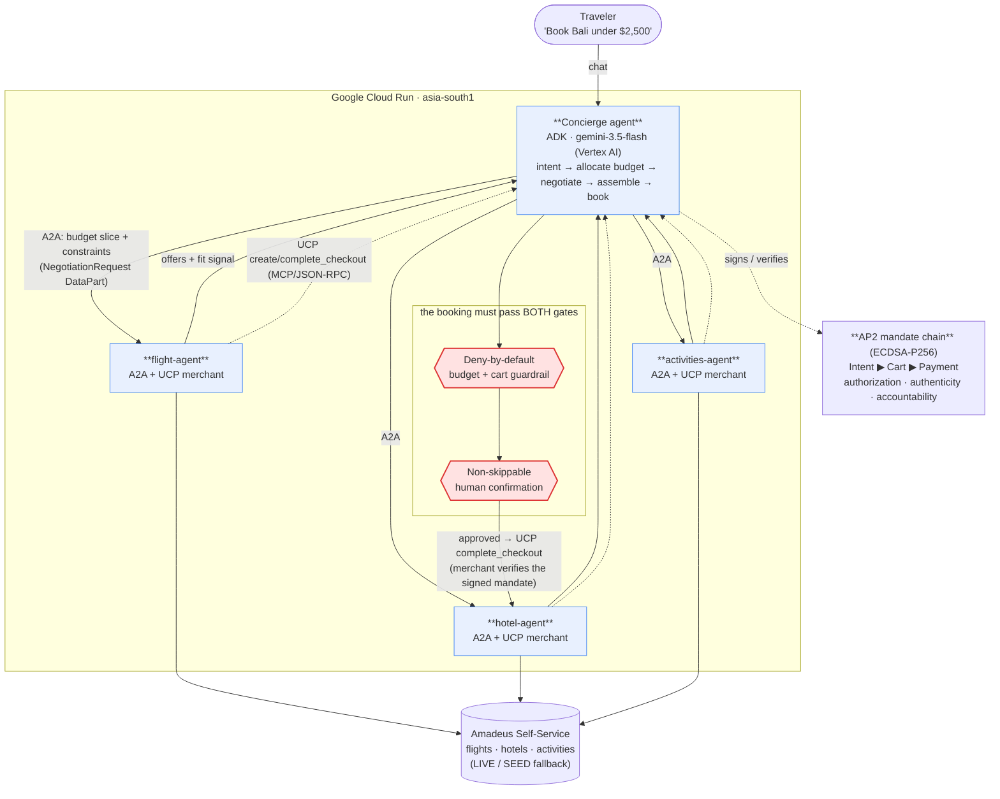

# Odyssey — Architecture

**One conversation books a whole multi-vendor trip — and nothing is spent without a budget-checked,
human-approved, cryptographically-signed mandate.**

A planner **Concierge** agent (ADK + Gemini on Vertex AI) negotiates over **A2A** with three independent
merchant agents (flight / hotel / activities), each a **UCP** merchant over Amadeus inventory. Every
purchase passes two gates — a **deny-by-default budget/cart guardrail** and a **non-skippable human
confirmation** — and settles via **AP2** signed Intent → Cart → Payment mandates (real ECDSA P-256; demo keypair). All four
services run on **Google Cloud Run (asia-south1)**.

## The two protocols doing the work

| Layer | Protocol | What it does in Odyssey |
|---|---|---|
| Agents talking | **A2A** (Agent2Agent) | Concierge sends each merchant agent a `NegotiationRequest` (budget slice + constraints) as a `DataPart`; the merchant's own Gemini agent answers with its `find_offers` result. Cross-process, between separate Cloud Run services. |
| Commerce nouns/verbs | **UCP** (Universal Commerce Protocol) | Each merchant exposes `/.well-known/ucp` + an MCP/JSON-RPC `/mcp` endpoint (`search_catalog`, `create_checkout`, `complete_checkout`, …). The concierge assembles + books through these. |
| Money trust | **AP2** (Agent Payments Protocol) | Every purchase is a signed **Intent → Cart → Payment** mandate chain; the merchant verifies the user-signed PaymentMandate server-side before confirming. Signatures are **real ECDSA P-256** (`cryptography`, demo keypair) — no real money moves. |
| Reasoning | **Gemini 3.5 Flash on Vertex AI** | Concierge dialogue + each merchant agent's tool-calling. |
| Tool binding | **MCP** (JSON-RPC 2.0) | UCP operations are invoked via `tools/call`. |

## The trust gates (why an enterprise can let this touch a card)

1. **Deny-by-default guardrail** (`before_tool_callback`): a checkout tool is refused unless there's an
   assembled cart whose total is `≤ budget`. Over-budget or premature checkout is denied with a reason.
2. **Non-skippable human confirmation** (ADK `require_confirmation`): `complete_trip` cannot run until the
   user explicitly approves — the agent literally cannot spend without a human in the loop.
3. **Signed audit trail** (AP2): the Intent → Cart → Payment chain is a tamper-evident record of *what was
   authorized, by whom, within what budget* — the non-repudiable receipt finance needs.

_Render the PNG for Devpost from this Mermaid source (e.g. mermaid.live → Export PNG)._
